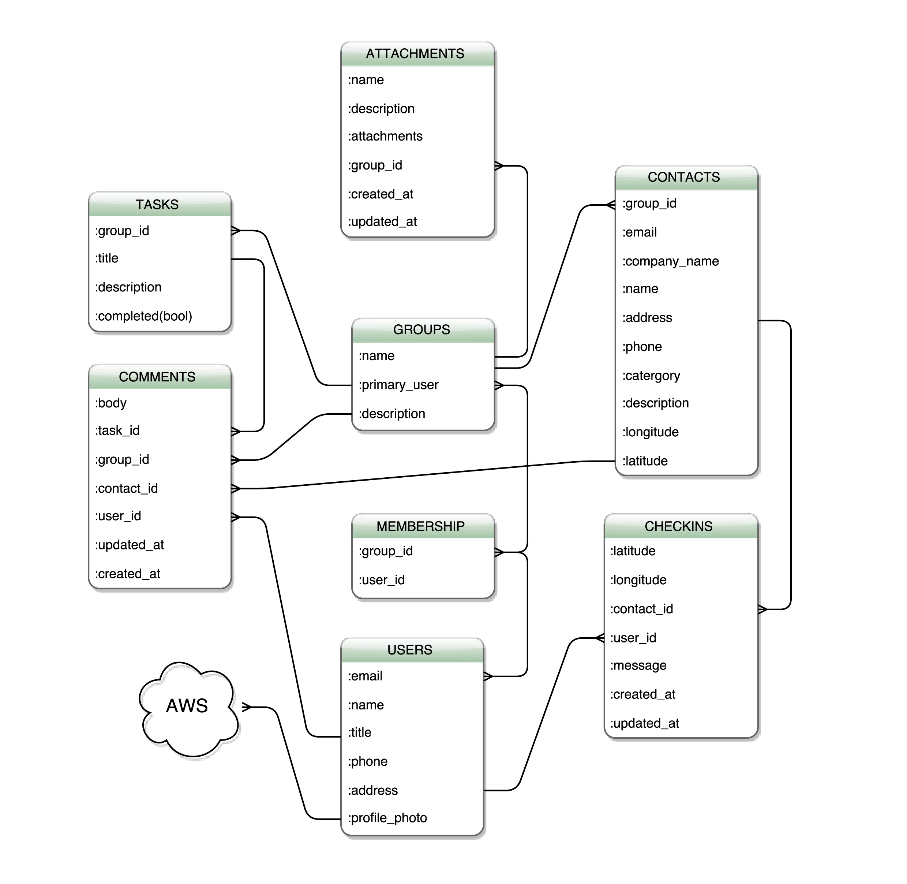

# HQ
### Launch Academy Final Project Fall 2015

#### ER Diagrams

#### Purpose
This is the final project for Launch Academy Fall 2015.  It is a team organizational app that allows users to create or join various groups.  Each group has tasks, contacts, and files that can be accessed by all group members.  Only the primary user can edit, delete or add users to a group. Any group member can add a task, contact, or file, none of which has an explicit primary user.  All users have the ability to check-in to either their current location or to the location of an existing contact.

#### Methods
This app was built on Rails.  I used the Devise gem for user authentication, Carrierwave gem for file and image uploads, and Geocoder gem for coordinates interpretations.  Testing was done with Rspec aided by Capybara and Shoulda-Matchers. JavaScript was used for pop-up info, dropdown menus, disabling forms, and autocomplete searching. Foundation and Sass was used for CSS styling.

